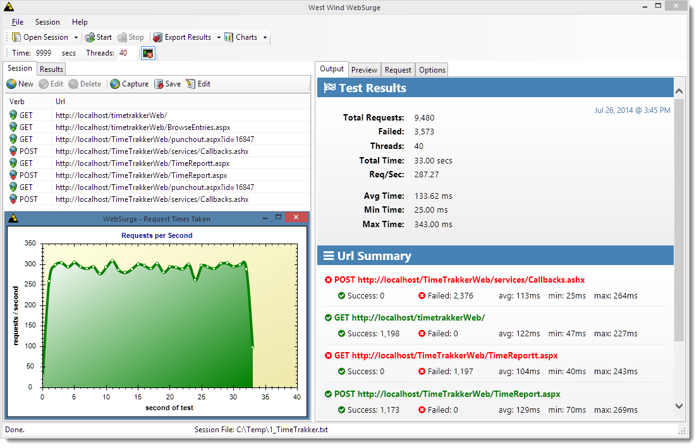

# West Wind WebSurge
#### Quick and easy URL and load testing for your Web applications

 

### Get it
* [Download WebSurge](https://websurge.west-wind.com) 
* [Install WebSurge from Chocolatey](https://chocolatey.org/packages/WestwindWebSurge)

Like what you see? Don't forget to  :star: Star the repo (top right).

### What's WebSurge?
West Wind WebSurge is a Windows application that helps you to easily capture and play back URL requests, either individually for easy application, service and API testing scenarios, or under heavy load for stress testing scenarios. WebSurge makes it easy to save, share and reuse URL sessions you have created, so you can easily start up sessions again on your own or somebody else's machine. 

Here's what the stress testing output looks like:

#### Web Stress Testing
The goal of this tool is to make it drop dead easy to capture or craete HTTP request content and test and play it back easily under load. It provides simple results that are easy to understand and act on. It's so easy that you can *frequently* stress test Web applications for load  characteristics during development, testing and in production.

* Easy capture or manual entry of URLs
* Interactive recording of screen sessions
* Quickly access and run your test
* Test and preview individual URLs 
* Immediate process feedback

#### Interactive URL Testing
WebSurge is great for load testing, but it's also an excellent URL test tool for developers who need to test API, SOAP or any other type of HTTP application service. You can easily capture sessions and easily recall individual URLs for testing of endpoints. The formatted output views make it easy to visualize the resulting contact with syntax highlighted markup/text as well as a preview for HTML content. We've optimized the UI flow to make request access and tests as easy as possible.  If you've used tools like PostMan or Fiddler to for these tasks, check out WebSurge for creating savable and shareable sessions that you can easily test repeatably. Sessions are stored in plain files and can easily be shared in source control, the file system, or via cloud storage solutions like DropBox or OneDrive. And because it's just text it's easy to modify Sessions in raw form or generate them via code.

And here is a screen shot that demonstrates simple URL testing or reviewing
of individual request output from a test run.

**Use Cases:**

* Load testing Web applications and services
* Easy URL testing and debugging for REST and data services
* URL management for saving, sharing, restoring

**Features:**

* Easy to set up, easy to run tests
* Built-in capture tool
* Or create requests individually
* Capture sessions from your browser
* Capture sessions from Windows clients
* Import sessions from Fiddler
* Manually create session as text
* Complete HTTP and SSL Support
* Test HTML, AJAX, REST and SOAP Services
* Simple summarized results
* Export results to Xml,Json,Html, Raw Headers
* Test locally and within your Firewall/VPN
* Optional Command Line Interface

**More info:**

* [WebSurge Product Page](http://west-wind.com/websurge/)
* [Getting started with WebSurge Video](http://youtu.be/O5J8mDfVZH8)
* [Introducing WebSurge Blog Post](http://weblog.west-wind.com/posts/2014/Jul/15/West-Wind-WebSurge-an-easy-way-to-Load-Test-Web-Applications)
* [Licensing](http://west-wind.com/websurge/pricing.aspx)
* [Download](http://www.west-wind.com/files/WebSurgeSetup.zip) or
  [install from Chocolatey](http://chocolatey.org/packages/WestwindWebSurge)

**Developer Info:**

* [Change Log](ChangeLog.md)
* [To Do List](ToDo.md)

**Requirements:**

* Windows 10, 8, 7, Vista, 1, 2008, 2012
* .NET 4.5

**License:**

This tool is open source, but it is a licensed product that may require a paid license. 
This means the full source code is available and available for modification,
but both free and commercial versions of the product are available.

Please check this link for additional
[Licensing and Pricing information](http://west-wind.com/websurge/pricing.aspx).

**Warranty Disclaimer: No Warranty!**

IN NO EVENT SHALL THE AUTHOR, OR ANY OTHER PARTY WHO MAY MODIFY AND/OR REDISTRIBUTE THIS PROGRAM AND DOCUMENTATION, BE LIABLE FOR ANY COMMERCIAL, SPECIAL, INCIDENTAL, OR CONSEQUENTIAL DAMAGES ARISING OUT OF THE USE OR INABILITY TO USE THE PROGRAM INCLUDING, BUT NOT LIMITED TO, LOSS OF DATA OR DATA BEING RENDERED INACCURATE OR LOSSES SUSTAINED BY YOU OR LOSSES SUSTAINED BY THIRD PARTIES OR A FAILURE OF THE PROGRAM TO OPERATE WITH ANY OTHER PROGRAMS, EVEN IF YOU OR OTHER PARTIES HAVE BEEN ADVISED OF THE POSSIBILITY OF SUCH DAMAGES.
