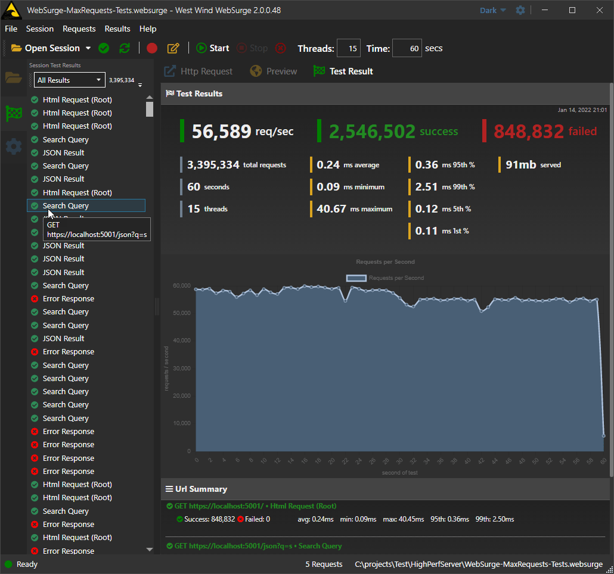

# West Wind WebSurge

#### Http REST Client and Http Load Testing for Windows

 

Like what you see? Don't forget to :star: star the repo.

### What is WebSurge?
West Wind WebSurge is an interactive HTTP REST Client and Web Load Testing tool for Windows. 

Use it to create, import or capture and Http requests, either individually for interactive API or Web request testing and debugging (a la Postman), or use it for Http Load Tests that can play back a session of requests under heavy load.

The goal is to make it quick and easy to create Http requests as sessions, and then fire them either  individually for typical REST request testing, or for load testing all or selected requests. The goal is to integrate Http testing and load testing with minimal friction into your development process.

> #### @icon-info-circle Source Code Access by Request
> Note this repository no longer holds source code for West Wind WebSurge, **due to rampant license abuse** in v1. v2 has moved to a private repository. Source code access is still available but only by request via private access for registered users.

### Screenshots
Here are a some screen shots that demonstrate the core features of WebSurge:

**Request View**  
The request view shows the raw Http request with headers and content. You can select, manage and run requests from this view. Most of the headers and request content of existing requests is also editable from here.

**Edit Request View**  
To create new requests or edit more detailed editing of requests, the edit view is used:

**Running a Load Test**  
To run a load test you press **Start**, but first set the Duration and Threads, which is the number of simultaneous sessions that run. Requests run in the background with a running tally showing in the HUD panel on the bottom of the main window. You can continue to use the UI while tests are running.

**Test Result View**  
The test result view shows a summary of the test that was just run. It'll provide request per second, failed requests, total requests, duration and a few other top level statistics. It also shows similar information for each individual Url of the session. 

**Command Line Interface**  
The load testing interface is also available via a Command Line tool (`websurgeCli`) that allows you to run load tests from the Windows Terminal and capture test results via Console output.

#### Goal of WebSurge
The goal of this tool is to make it drop dead easy to capture or create HTTP requests, quickly test them individually and then play them back easily under load. WebSurge provides simple results that are easy to understand and act on. It's quick and easy so that you can *frequently* stress test Web applications for load characteristics during development and in production.

* Easy capture or manual entry of URLs
* Interactive recording of screen sessions
* Quickly access and run your test
* Test and preview individual URLs 
* Immediate process feedback

#### Interactive Http Request Testing
WebSurge is great for load testing, but it's also an excellent URL test tool for developers who need to test API, SOAP or any other type of HTTP application service. 

It makes for a compelling alternative to the popular Postman tool and you can import sessions from Postman as well as from Fiddler traces.

You can easily capture sessions and easily recall individual URLs for testing of endpoints. The formatted output views make it easy to visualize the resulting contact with syntax highlighted markup/text as well as a preview for HTML content. We've optimized the UI flow to make request access and request execution and review as easy as possible. 

Sessions are stored in plain files and can easily be shared in source control, the file system, or via cloud storage solutions like DropBox or OneDrive. And because it's just text it's easy to modify Sessions in raw form or generate them via code.

#### Use Cases

* As a REST Client for testing API or Web Requests
* Load testing Web applications and services
* URL management for saving, sharing, restoring

### Requirements

* Windows 7+, Windows 2012+
* .NET 9.0 

### More info

* [WebSurge Web Site](https://websurge.west-wind.com/)
* [WebSurge Download](https://websurge.west-wind.com/download)
* [WebSurge Chocolatey Package](https://chocolatey.org/packages/WestwindWebSurge)
* [Licensing](http://west-wind.com/websurge/purchase#license)

### Developer Info

* [Change Log](ChangeLog.md)
* [To Do List](ToDo.md)
